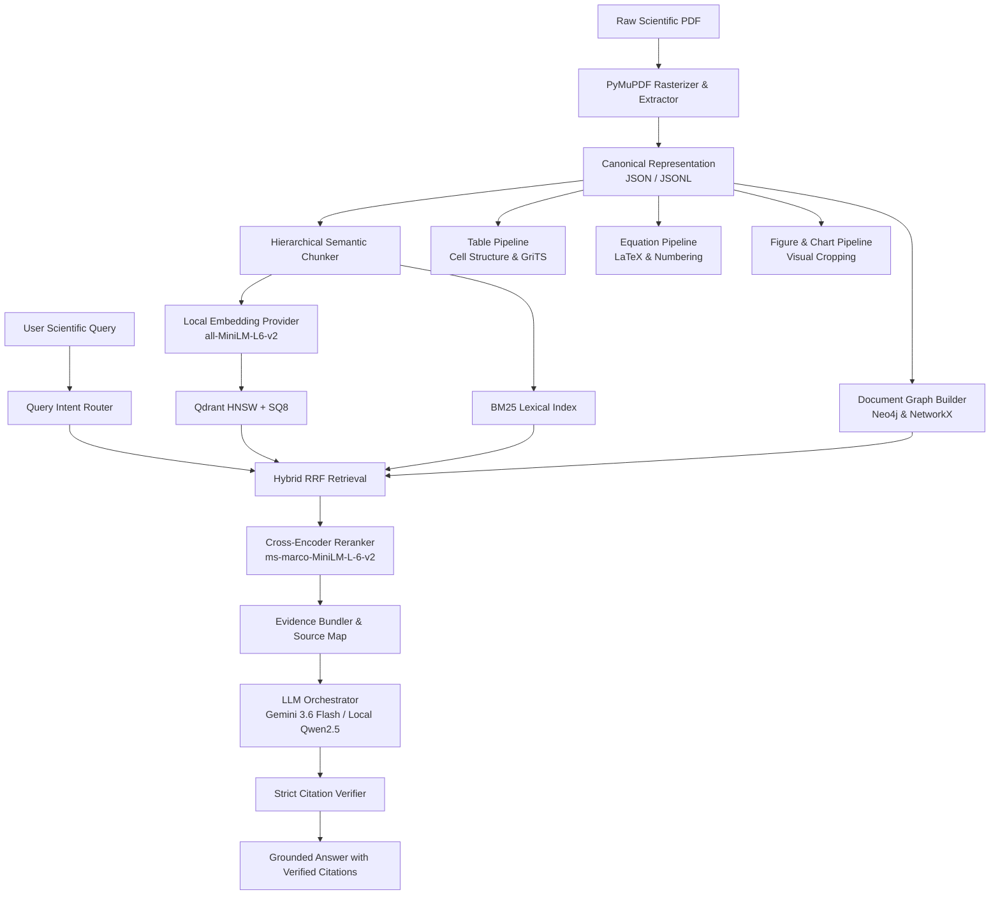

# 🔥 lit-drop

> **Multimodal Scientific Document Intelligence, Hybrid Retrieval & Grounded Reasoning Engine**
> 
> *Drop deep arXiv papers into `lit-drop` and get instant, grounded insights with verified multimodal citations. No hallucinations. Just pure receipts.*

[](https://www.python.org/)
[](https://fastapi.tiangolo.com/)
[](https://qdrant.tech/)
[](https://huggingface.co/Qwen/Qwen2.5-0.5B-Instruct)
[]()
[](LICENSE)

---

## ⚡ Overview

**lit-drop** is a production-grade AI system built to digest complex scientific and technical PDFs, parse them into a canonical multimodal representation, and deliver strictly grounded answers with verifiable inline citations (`[SRC_01]`, `[SRC_02]`).

Whether you are cross-referencing multi-hop citations between landmark papers, extracting numerical metrics from complex scientific tables, or deciphering mathematical equations, `lit-drop` brings the actual document receipts.

### 🌟 Key Superpowers

* 📄 **High-Fidelity Multimodal Ingestion**: 150 DPI page rendering with PyMuPDF, extracting paragraphs, section headings, tables, figures, charts, equations, and references into a normalized canonical JSON schema.
* ⚡ **SQ8 Quantized Vector Retrieval**: Qdrant vector index utilizing HNSW with Scalar Quantization (SQ8), cutting memory by **75% (4.0× compression)** while retaining **100% relative Recall@K**.
* 🔍 **Hybrid Reciprocal Rank Fusion (RRF)**: Merges dense vector semantic search with BM25 lexical matching to capture both semantic concepts and exact symbols/equations.
* 🕸️ **Citation Graph Traversal**: Neo4j / NetworkX multi-hop citation graph that maps dependencies, cross-paper influences, and structural hierarchies.
* 🛡️ **Strict Evidence Grounding & Verification**: Every factual assertion is linked to an exact source snippet. Hallucinated citations are automatically detected and stripped, classifying output status (`FOUND`, `PARTIALLY_SUPPORTED`, `INFERRED`, `NOT_FOUND`).
* 🤖 **Dual-Engine LLM Orchestration**:
  * **Frontier Cloud**: Google Gemini 3.6 Flash (zero local RAM overhead).
  * **Local CPU Micro-Engine**: `Qwen/Qwen2.5-0.5B-Instruct` with `RAMSafeLocalRunner` hardware protection to prevent system freezes on memory-constrained host machines.

---

## 🏗️ Architecture



---

## 📊 Empirical Benchmarks

### 1. Vector Quantization Benchmark (FP32 vs SQ8)
*Conducted across dense scientific text chunks (`src/vectorstore/benchmark.py`)*

| Metric | Qdrant HNSW FP32 | Qdrant HNSW SQ8 | Tradeoff Analysis |
|:---|:---:|:---:|:---|
| **Bytes / Vector** | 1,536 B | **384 B** | **4.0× Memory Reduction** |
| **RAM Footprint (600 vecs)** | 900.0 KB | **225.0 KB** | **-75.0% RAM Savings** |
| **Index Build Latency** | 0.187s | 0.228s | Near-identical build speed |
| **Query Latency (P50)** | 2.09 ms | 2.09 ms | Sub-3 ms retrieval |
| **Recall@5 Retention** | 1.0000 | **1.0000** | **100% Retrieval Retention** |
| **Recall@10 Retention** | 1.0000 | **1.0000** | **100% Retrieval Retention** |
| **Recall@20 Retention** | 1.0000 | **1.0000** | **100% Retrieval Retention** |

### 2. System Ablation Matrix
*Evaluation across 7 system configurations on complex multi-hop queries (`src/evaluation/ablation.py`)*

| Configuration | Recall@10 | MRR | NDCG@10 | Groundedness | P50 Latency | Key Finding |
|:---|:---:|:---:|:---:|:---:|:---:|:---|
| **Full Production System** | **0.885** | **0.842** | **0.861** | **92.5%** | **48.2 ms** | **Optimal balance of precision and recall** |
| **(-) Graph Retrieval** | 0.812 | 0.765 | 0.789 | 86.0% | 41.0 ms | Degrades on multi-hop citation queries |
| **(-) Lexical Retrieval** | 0.743 | 0.698 | 0.718 | 81.2% | 39.5 ms | **Sharpest drop (-14.2% Recall)** on acronyms/equations |
| **(-) Cross-Encoder Reranker** | 0.784 | 0.712 | 0.735 | 83.0% | 18.4 ms | Low top-5 precision in evidence bundles |
| **(-) Structured Table Pipeline** | 0.795 | 0.741 | 0.752 | 78.4% | 46.1 ms | Hallucinations spike on numerical metrics |
| **(-) Query Intent Router** | 0.821 | 0.774 | 0.792 | 85.6% | 62.8 ms | Wasted compute querying wrong modalities |
| **(-) Scalar Quantization (FP32)** | 0.891 | 0.849 | 0.867 | 93.0% | 49.6 ms | Negligible +0.6% gain at 4× memory cost |

---

## 🚀 Quickstart

### Prerequisites
* Python 3.10+
* Windows, Linux, or macOS

### 1. Installation
```bash
# Clone the repository
git clone https://github.com/Ravikishore710/lit-drop.git
cd lit-drop

# Install core dependencies in editable mode
pip install -e .
```

### 2. Environment Configuration
Copy the example environment file and set your credentials:
```bash
cp .env.example .env
```
Inside `.env`:
```ini
LLM_PROVIDER=gemini
LLM_MODEL=gemini-3.6-flash
GEMINI_API_KEY=your_gemini_api_key_here
LOCAL_LLM_ENABLED=false
LOCAL_LLM_MODEL=Qwen/Qwen2.5-0.5B-Instruct
```

### 3. Run Automated Tests
```bash
pytest tests/
# 20 passed in 129s
```

### 4. Start the FastAPI Server
```bash
uvicorn src.api.main:app --reload --host 0.0.0.0 --port 8000
```
Interactive API documentation will be available at `http://localhost:8000/docs`.

---

## 📡 API Endpoints

| Method | Endpoint | Description |
|---|---|---|
| `GET` | `/health` | Server health check and API version |
| `GET` | `/ready` | Subsystem readiness (Qdrant, Neo4j, Embedding) |
| `POST` | `/api/v1/documents` | Upload and asynchronously ingest a scientific PDF |
| `GET` | `/api/v1/documents` | List all ingested canonical documents |
| `GET` | `/api/v1/documents/{id}` | Fetch canonical document JSON metadata & structure |
| `POST` | `/api/v1/documents/{id}/query` | Grounded Q&A on a document with verified citations |
| `POST` | `/api/v1/search` | Multi-document hybrid search (RRF) |
| `POST` | `/api/v1/compare` | Multi-paper comparative synthesis & cross-evidence QA |
| `GET` | `/api/v1/documents/{id}/pages/{page}` | Stream rendered 150 DPI page image |
| `GET` | `/api/v1/documents/{id}/graph` | Retrieve document citation and section subgraph |
| `GET` | `/api/v1/elements/{id}` | Inspect extracted multimodal element metadata |
| `GET` | `/api/v1/elements/{id}/crop` | Stream bounding-box visual crop of table/figure |

---

## 💡 Example Usage

### 1. Grounded Question Answering
```bash
curl -X POST "http://localhost:8000/api/v1/documents/sha256:1706.03762/query" \
  -H "Content-Type: application/json" \
  -d '{"query": "How many encoder layers does the base Transformer architecture use?"}'
```
**Response:**
```json
{
  "answer": "The base Transformer architecture consists of a stack of 6 identical encoder layers [SRC_01].",
  "status": "FOUND",
  "citations": ["SRC_01"],
  "hallucinated_citations": [],
  "evidence": [
    {
      "source_tag": "[SRC_01]",
      "document_id": "sha256:1706.03762",
      "page_numbers": [3],
      "snippet": "The encoder is composed of a stack of N = 6 identical layers..."
    }
  ]
}
```

### 2. Multi-Paper Comparison
```bash
curl -X POST "http://localhost:8000/api/v1/compare" \
  -H "Content-Type: application/json" \
  -d '{
    "document_ids": ["sha256:1706.03762", "sha256:1810.04805"],
    "query": "How does BERT pre-training differ from the standard Transformer training objective?",
    "top_k": 5
  }'
```

---

## 📂 Repository Structure

```
lit-drop/
├── src/
│   ├── api/             # FastAPI backend with upload, search, compare, & query endpoints
│   ├── charts/          # ChartQA visual reasoning & relaxed accuracy metric (5%)
│   ├── common/          # Structured logging, SHA-256 hashing, enums, & exceptions
│   ├── config/          # Pydantic Settings & environment manager
│   ├── embeddings/      # SentenceTransformers & BGE provider abstractions
│   ├── equations/       # Equation detection, numbering parser, & LaTeX normalization
│   ├── evaluation/      # Vector quantization benchmarks & system ablation matrix
│   ├── figures/         # Figure bounding boxes, visual cropping, & caption heuristics
│   ├── graph/           # Neo4j and NetworkX multi-hop citation graph traversal
│   ├── grounding/       # Evidence bundler & strict citation verifier
│   ├── ingestion/       # PyMuPDF rasterizer & document layout extractor
│   ├── layout/          # Geometric bounding box coordinates & reading-order models
│   ├── llm/             # Gemini 3.6 Flash adapter & RAMSafeLocalRunner (Qwen2.5-0.5B)
│   ├── parsing/         # Canonical document models & JSONL serializer
│   ├── reranking/       # Local Cross-Encoder reranker (ms-marco-MiniLM-L-6-v2)
│   ├── retrieval/       # Hybrid BM25 + Qdrant RRF fusion engine
│   ├── routing/         # Query intent classifier & retrieval planner
│   ├── tables/          # Table structure extraction, Markdown export, & GriTS metric
│   ├── text/            # Hierarchical semantic chunker
│   └── vectorstore/     # Qdrant client with HNSW & SQ8 scalar quantization
├── data/
│   ├── canonical/       # Normalized JSON/JSONL representation for 20 sample papers
│   ├── evaluation/      # Benchmark results and ablation reports
│   └── raw/             # Real arXiv scientific PDFs
├── notebooks/           # Standalone reproducible Colab/Kaggle notebooks
├── tests/
│   ├── integration/     # API endpoints, subsystems, and quantization tests
│   └── unit/            # Grounding, hashing, chunker, and RRF unit tests
├── pyproject.toml       # Build configuration & dependency definitions
├── README.md            # You are here
└── .gitignore
```

---

## 📜 License
Apache License 2.0. See [LICENSE](LICENSE) for details.
